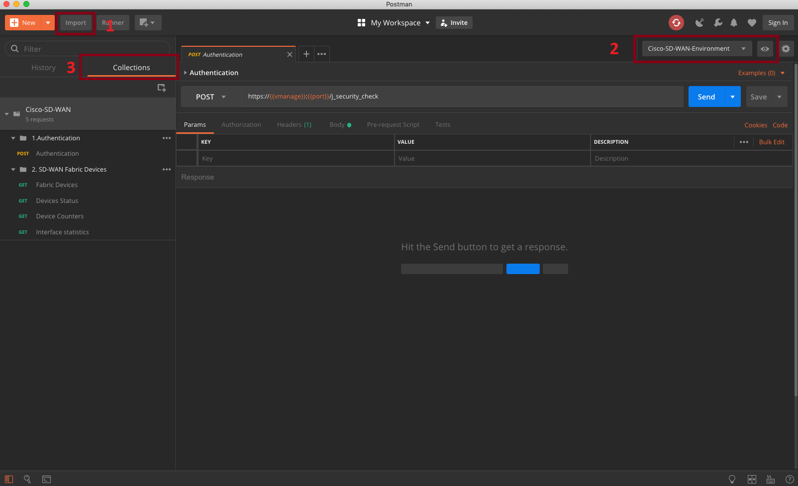
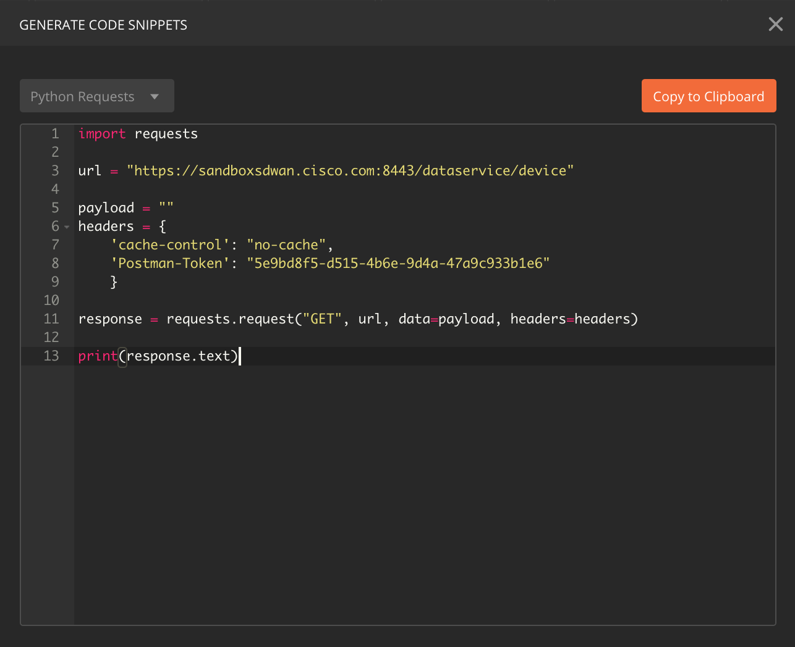

# Postman for Cisco SD-WAN

This public repo contains a [POSTMAN](https://getpostman.com) environment and collection that can be used to interact with the `Cisco SD-WAN powered by Viptela vManage REST API`. The environment is pre-configured to access the [Cisco DevNet Always On Sandbox for SD-WAN](https://sandboxsdwan.cisco.com:8443) fabric. You can edit the variables in the environment to point to your own vManage instance. The collection contains REST API calls to authenticate, get a list of devices that are part of the SD-WAN fabric, and get device status, counters, and interface statistics for all the interfaces in the fabric. Feel free to modify them as you see fit and to add more calls to the collection.

# Requirements

The Postman collection and environment will need:
* Postman 6.4.4+
* Cisco SD-WAN powered by Viptela vManage 18+

# Setup

If you don't have Postman already installed, you can download it from [here](https://getpostman.com). Once you install it, you can follow the steps below to import the collection and environment:

1. Click on `Import`, browse to the location where you cloned this repo and add the two files:
    1. `Cisco-SD-WAN-Environment.postman_environment.json`
    2. `Cisco-SD-WAN.postman_collection.json`
2. Make sure you select the `Cisco-SD-WAN-Environment` environment
3. Expand the collection and start making REST API calls.

You can also export the API call into your preferred programming language, like Python or Go.

### Note: In case your instance of vManage has a self signed certificate, make sure you disable `SSL certificate verification` in Postman's settings.
